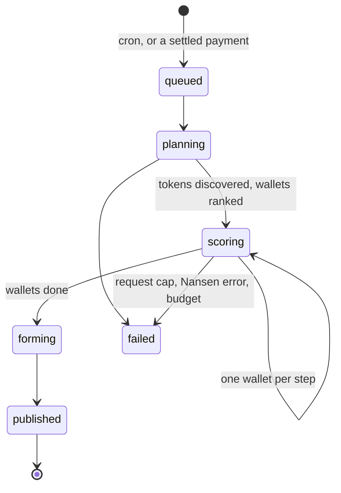

# Zatto

[](https://zatto.nsawinyh.workers.dev)
[](https://github.com/sneg55/zatto/actions/workflows/ci.yml)
[](https://developers.cloudflare.com/workers/)
[](https://nextjs.org)
[](https://x402.org)
[](https://nansen.ai)
[](LICENSE)

Point it at a Base token and it tells you which Smart Money wallets bought it, how many new buyers arrived in the 10 minutes after each buy, and what tokens at that level of buying have done a day later. Point it at a wallet and it tells you who buys behind it and what copying it returned.

Built for the Nansen Meridian Buildathon (Sep 14-27, 2026). Powered by Nansen API.

## What Zatto measures

Zatto has three subjects.

A **token** is the main one. It reads every Smart Money buy in that token over `TOKEN_SCAN_DAYS` days and measures the burst of new buyers that followed each one, then states how buys at that burst have done 24 hours later.

A **wallet** gets the same measurement over its own recent buys, plus what a delayed entry behind it returned. Its page carries a live panel of the buyers arriving after its newest buy, scored on burst alone because no return has settled yet.

A **run** sweeps a chain. It ranks the tokens Smart Money bought by the hardest burst each one took, nests the wallets that triggered those bursts under them, and puts the wallet leaderboard below as supporting detail.

Zatto claims three things, and only these:

- Counts of distinct new buyer addresses of the same token in fixed windows after the wallet's buy, against the token's own prior-hour rate.
- The share of those arrivals inside 20 seconds ("fast arrivals").
- The token's price return from the wallet's fill and from a delayed entry, at fixed horizons.

Zatto does not claim any address copied the wallet, and it does not predict.

## How one buy is measured

```
        t-60m                      t0                  t+10m                t+24h
          |-------- baseline -------|------- burst ------|                     |
                                    |
                                    +-- t+60s: the copy entry is priced here,
                                                and marked again at t+1h and t+24h

  baseline   distinct addresses that bought this token in the hour before the buy,
             never treated as lower than BASELINE_FLOOR
  burst      distinct new buyers in the 10 minutes after, over that baseline scaled
             to 10 minutes and floored at BURST_FLOOR. From CROWD_RATIO it is crowded.
  copy       what buying DELAYED_ENTRY_SECONDS after the wallet and holding returned
  leader     the same return priced at the wallet's own fill, for comparison
```

A burst settles `BURST_MINUTES + MATURITY_MINUTES` after the buy. A return needs a full day, and the profiler will not honour a `date.to` bound inside roughly the last day, so a buy is only scored once it is `SCORABLE_AGE_MINUTES` old. Everything newer than that goes on the Forming now board with a burst and no return.

## How it fits together

```mermaid
flowchart LR
  U["Browser"]
  subgraph cf["Cloudflare"]
    W["Worker&#8203;<br/>Next.js 16 via OpenNext"]
    D[("D1&#8203;<br/>hour-bucketed tape,<br/>scores, observations, jobs")]
    C(["Cron, every 5 min"])
  end
  N["Nansen API"]
  F["PayAI facilitator"]
  U -->|"token and wallet pages"| W
  U -->|"POST /api/scan/base"| W
  C --> W
  W <--> D
  W -->|"screener, tgm/dex-trades,<br/>profiler, token-ohlcv"| N
  W -->|"verify and settle 1 USDC"| F
```



A run is a chain of short steps rather than one long request, because a Worker cannot sit on a 20 minute job. Each step takes a lease, does what it can inside its budget, writes to D1 and triggers the next one.



A step that dies holding a lease is picked up by the sweeper and resumed where it stopped, not restarted. The forming pass runs last, under its own request and time budget, so it can never keep a fully scored run from publishing.

## Verdicts

A token gets a crowd class from its own entries:

- `CROWDED`: at least one scored entry drew a crowd (`crowdRatio10 >= 3`, see Method). Crowding is an event, so one measured entry settles it.
- `QUIET`: scored entries exist and none of them drew a crowd.

A wallet gets a crowd class and a return note under a stricter rule, because a wallet is a habit rather than an event:

- `THIN`: fewer than 4 scored buys in the lookback window. Not enough data for a verdict.
- `CROWDED`: more than half of scored buys drew a crowd.
- `QUIET`: scored buys exist but a crowd formed on half or fewer of them.

On the runs measured so far no wallet has been `CROWDED`, because crowding concentrates in a handful of tokens rather than spreading across any one wallet's whole book. The board leads with tokens for that reason.

Repeated swaps by one wallet into one token inside the same hour are one buy, not several. The profiler returns each fill of a split swap as its own trade, and counting them separately makes a median over copies of a single entry.

The delayed-entry return comparison is stated across the whole run rather than per wallet, because eight buys per wallet rarely fill both groups at `MIN_GROUP`. The scan page states the crowded and quiet medians side by side with the number of buys behind each and the number of distinct token minutes and tokens they came from, so a single entry replicated across an address cluster cannot read as many observations.

## Quick start

```
git clone https://github.com/sneg55/zatto.git
cd zatto
npm i
npx wrangler login
npx wrangler d1 create zatto
```

Paste the database id the last command prints into `wrangler.jsonc`, replacing `REPLACE_AFTER_wrangler_d1_create`.

In the same file, replace the `PUBLIC_BASE_URL` var, which ships as `https://zatto.REPLACE.workers.dev`, with the URL the Worker will be deployed to. It is the host the scan step trigger calls and the host in the scan URL a payer gets back, so every request fails with a message pointing here until it is set.

```
npm run cf-typegen
npm run migrate:remote
npx wrangler secret put NANSEN_API_KEY
npx wrangler secret put X402_PAY_TO
npx wrangler secret put INTERNAL_SECRET
npx wrangler secret put FACILITATOR_URL
npm run deploy
```

`wrangler secret put` sets the key the deployed Worker uses. `INTERNAL_SECRET` is yours to invent and is never shown to anyone: `openssl rand -hex 32` prints a usable one to paste at the prompt. `scripts/proof.ts` runs locally and reads its own copy from `.dev.vars`, so copy `.dev.vars.example` to `.dev.vars` and fill in a real `NANSEN_API_KEY` before the next step.

```
npm run proof
npm run seed:fixtures
```

`npm run proof` is a live check against the real API. It prints its own request count and writes its raw responses to `tests/fixtures/real/`, including `wallet-score.json`. `npm run seed:fixtures` is optional: once that file exists, it loads it into D1 as one completed run so the leaderboard and one wallet page render without waiting for the first cron run. The repo does not ship with a fixture snapshot; only `tests/fixtures/real/.gitkeep` is checked in. Run `proof` first, or `seed:fixtures` has nothing to load and exits with an error saying so.

### Troubleshooting

`opennextjs-cloudflare build` (used by `npm run preview` and `npm run deploy`) cleans out `.open-next/` itself. Running a plain `npm run build` right after a `preview` without that cleanup leaves a stale `.open-next/` directory behind, and the `@ts-expect-error` in `worker/index.ts` then reports TS2578 because the stale build no longer matches the source it is suppressing. `rm -rf .open-next` before a plain `npm run build` fixes it.

## Local with fixtures

```
ZATTO_LOCAL=1 npm run migrate:local
```

Once `npm run proof` has produced `tests/fixtures/real/wallet-score.json` (see Quick start, that step needs a real `NANSEN_API_KEY`), seed the local database from it and run the app with no further Nansen calls:

```
ZATTO_LOCAL=1 npm run seed:fixtures
npm run dev
```

## Paid scans

`POST /api/scan/base` is an x402 seller. It returns 402 until paid, then 202 with a `run_id` once the payment settles. Price is 1 USDC on Base (`eip155:8453`), paid to `X402_PAY_TO`, settled through a single facilitator (PayAI).

Pay it with a funded Base private key:

```
PAYER_KEY=0x... npm run pay -- https://<your-host>/api/scan/base
```

The scan page pays from a browser wallet. It reads the terms out of the 402, asks the wallet to sign the EIP-3009 transfer authorisation (a signature, not a transaction, so it costs no gas), retries the request with the payment, and opens the run the moment settlement returns. A terminal path stays available behind a disclosure on the same panel.

The 402 advertises the asset's EIP-712 domain in `extra`, which Base USDC reports on chain as `name` "USD Coin" and `version` "2". Without it a client cannot build a payload at all, and the endpoint answers every payment attempt with a domain error.

`scripts/pay.ts` is a small, public script on `@x402/fetch` and `@x402/evm`. It signs the payment with `PAYER_KEY` and retries the request. No dependency on private code.

A settled job that later fails (step limit, a Nansen error, budget exhaustion) is shown on its scan page as failed, with the reason and the settlement transaction. Failed paid runs are refunded manually by the operator on request, with that transaction as the reference. Nothing about a refund is automatic.

### If a paid scan does not run

A job can reach one of two states where the payment may have settled but the app never recorded the outcome:

- Status `settling`: the app claimed the job and called the facilitator but crashed or timed out before storing the result. The scan page shows it as not started, retrying the same payment returns 202 with the same run id pointing at a scan page that never progresses, and `/api/health` lists it under `settling` jobs.
- Status `failed` with the error "settlement facilitator unreachable": the facilitator call threw after the payment may have already been submitted. Retrying returns 402.

In both cases, the resolution is manual. Check the payment nonce against the facilitator or on chain. If it settled, the operator refunds or reruns the scan by hand. Neither state auto-recovers because failing a `settling` job on a timer could mislabel a successful settlement as failed. The scan page for a run shows its status and any error, and `/api/health` lists jobs by status.

## Method

The site itself carries no methodology section: it states the answer and links back here. The labels it uses map onto the terms below.

| On the site | In this file and in the code |
|---|---|
| Buyers vs normal | `crowdRatio10`, the burst ratio |
| Copy return | the delayed entry, `DELAYED_ENTRY_SECONDS` after the wallet's buy |
| The wallet's own | the leader return, priced at the wallet's own fill |
| Cluster | an address fleet, wallets carrying byte-identical buy lists |
| Entry | one token minute, after repeated swaps inside an hour collapse |

Constants live in `lib/score/constants.ts`. They are choices made for this build, not measurements of anything:

| Constant | Value | Meaning |
|---|---|---|
| `CROWD_RATIO` | 3 | New buyers in the burst window at or above 3x the token's prior-hour rate, scaled to that window, counts as a crowd |
| `BASELINE_FLOOR` | 3 | The hourly baseline is never treated as lower than 3 per hour, so a baseline of 0 or 1 does not turn a handful of buyers into a crowd |
| `BURST_MINUTES` | 10 | The window the crowd verdict is decided on. New buyers over a full hour revert to the token's own rate by construction: across 34 scored buys on Base the 60 minute ratio never reached 3x, while the 10 minute ratio ran a median of 1.04x, 3.15x at the 90th percentile and 17.57x at the top |
| `BURST_FLOOR` | 2 | The prior-hour rate scaled to the burst window is never treated as lower than 2 buyers |
| `FAST_SECONDS` | 20 | Window for a "fast arrival" |
| `DELAYED_ENTRY_SECONDS` | 60 | A delayed entry is priced at the first trade at or after this many seconds past the wallet's buy |
| `MIN_USABLE_BUYS` | 4 | Below this many scored buys, the wallet's verdict is `THIN` |
| `MIN_GROUP` | 3 | Below this many mature buys in the crowded or the uncrowded group, that group's median return is `insufficient` rather than stated |
| `LOOKBACK_DAYS` | 30 | How far back qualifying buys are pulled for a wallet |
| `MAX_BUYS_PER_WALLET` | 8 | The most recent qualifying buys kept per wallet, after collapsing repeated swaps into one token in one hour |
| `TOP_WALLETS` | 10 | How many Smart Money wallets a scan run scores, ranked by buy count on the discovered tokens |
| `DISCOVERY_TOKENS` | 12 | How many tokens a scan sweeps for Smart Money buyers, interleaved from two screener calls: one filtered to tokens under `FRESH_TOKEN_MAX_AGE_DAYS`, one unfiltered. Discovery draws on its own budget, so it cannot starve the wallet fetch |
| `FRESH_TOKEN_MAX_AGE_DAYS` | 14 | The age bound on the fresh half of discovery. Sorting the screener by volume alone returns tokens already doing tens to hundreds of buyers an hour, where nothing can look like a burst |
| `MATURITY_MINUTES` | 15 | How long after an hour bucket or a candle minute Zatto waits before treating it as final, to allow for late-indexed trades |
| `SCORABLE_AGE_MINUTES` | 2880 | How old a buy must be before it is used for scoring. The profiler endpoint does not honor a `date.to` bound inside roughly the last day, so the cutoff has to clear that window, not just the 24 hour return horizon plus maturity |
| `TOKEN_SCAN_DAYS` | 7 | How far back a token scan reads Smart Money buys. One `tgm/dex-trades` call with `only_smart_money` covers the whole window |
| `TOKEN_SCAN_ENTRIES` | 20 | How many distinct entries a token scan scores. A token that fills a 1,000-row page is read as its newest entries rather than the whole window, and the page says so |
| `FORMING_WINDOW_HOURS` | 48 | How far back the forming pass looks for buys too recent to score. Beyond it a buy is old enough to carry a return and belongs on the scored board instead |
| `FORMING_BUYS` | 15 | How many of the newest such buys the pass scores |
| `FORMING_REQUESTS` | 24 | The pass's own request budget, separate from the step's, so a forming pass cannot consume the requests a scored run still needs |
| `FORMING_SECONDS` | 25 | The pass's own time budget, for the same reason. Without one an early version outlived the step lease and left a fully scored run unpublished |
| `CARRY_FORWARD_MAX_MINUTES` | 60 | `tgm/token-ohlcv` only returns a candle for a minute that actually had a trade, so a target minute with no candle of its own resolves to the close of the nearest earlier candle, as long as that candle is within this many minutes. Beyond it the price is too stale to use and the minute is recorded `missing` instead |

What the code does today: an hour bucket is fetched from `tgm/dex-trades` up to 3 pages of 1,000 rows; a bucket that still needs a 4th page, or whose stored rows exceed 1,500,000 bytes, is marked capped and every buy that needs it becomes unusable. A `tgm/token-ohlcv` minute with no candle at that exact minute is resolved to the nearest earlier candle within `CARRY_FORWARD_MAX_MINUTES`; past that bound, or with no earlier candle at all, it is recorded as a `candle_gap` row (`missing`, `truncated`, or `pending`) rather than treated as a zero return.

Measured on run `manual-base-6` against the live API on 2026-09-15, published at `/scan/base/manual-base-6`: 30 wallets discovered across 24 screener tokens and scored for 458 requests, giving 162 wallet buys that collapse to 120 distinct token minutes on 42 tokens. Wallets entering the same token in the same minute are one observation, because a fleet acting together is one event however many addresses carry it.

The burst ratio ran a median of 0.85x and 2.74x at the 90th percentile, with 38.50x at the top. Across the five bands the run put 67 entries under 1x, 30 between 1 and 2x, 11 between 2 and 3x, 5 between 3 and 5x and 7 at 5x or more, so 12 of 120 cleared the 3x threshold. Entering one minute after those crowded entries returned a median +18.7% at 24 hours, against -7.1% after the 108 quiet ones.

The crowding is concentrated rather than spread: 10 of the 42 tokens account for every crowded entry. LOTTO carried 3 of them over 7 scored entries and returned a median +106.6%, PLUMBER drew the hardest burst of the run at 38.50x and still lost 35.0% at 24 hours, and `$POOP` cleared 17.00x for +22.7%. No wallet was CROWDED, because that needs more than half of one wallet's own buys to draw a crowd and the highest was well under it.

An earlier revision of this file quoted 33 crowded buys and +39.8% for the same run. Those figures counted a seven-wallet fleet's simultaneous entries once per wallet. The numbers above count each token minute once, which is the correct denominator, and the code was fixed to match.

## What a burst has been worth

Zatto makes one forward-looking statement, and only this one: of the entries it has already measured at a given burst, how many were higher a day later. It is a base rate for an observed event, not a forecast, and a band under `MIN_RATE_OBSERVATIONS` entries states its count instead of a rate.

Measured on 2026-09-16 over 429 entries on Base, one row per token minute so a fleet counts once. Return is a delayed entry one minute after the Smart Money buy, held 24 hours.

| Burst band | Entries | Tokens | Higher at 24h | Median | p25 | Worst |
| --- | --- | --- | --- | --- | --- | --- |
| under 1x | 263 | 42 | 80 of 263 | -6.4% | -17.3% | -100.0% |
| 1 to 2x | 104 | 28 | 52 of 104 | +0.1% | -16.9% | -62.4% |
| 2 to 3x | 25 | 18 | 10 of 25 | -7.2% | -21.2% | -44.1% |
| 3 to 5x | 16 | 13 | 10 of 16 | +4.9% | -3.5% | -82.4% |
| 5x and up | 21 | 17 | 17 of 21 | +29.6% | +15.7% | -74.1% |

The signal sits at `SIGNAL_RATIO` and above. Everything below it is close to a coin flip, which is why the 3x `CROWD_RATIO` tag on the boards is descriptive only and carries no claim about price. The 5x band held its share as the sample grew from 16 entries to 21, and at 8x and above it was 10 of 10 tokens with 8 higher.

Two limits worth stating plainly. The 1 hour horizon carries almost nothing, +1.4% against +0.3%, so this is a next-day effect and not an intraday one. And tokens reach the table through the Nansen Smart Money screener, which selects on Smart Money activity rather than on price; the rates are conditional on that selection.

## Does the wallet ranking hold

`/copied/base` ranks wallets by what copying them returned, and the page states a split-half test of that ranking instead of a caveat. Each wallet's settled buys are split in half by time, wallets are ranked on the early half, and the later halves of the leaders are pooled against the later halves of everyone else. A wallet needs `MIN_COPY_BUYS` priced buys to be ranked at all.

Read live on 2026-09-18, with 26 of 55 wallets clearing the floor: the top 5 on their earlier buys returned a median +49.0% on their later ones, 18 of 22 higher at 24 hours, against -8.0% and 38 of 108 for the other 21.

The Spearman rank correlation between the halves, measured on 2026-09-17, was +0.319, and +0.238 with the strongest wallet dropped. Pearson on the same data reads +0.665; the rank correlation is the one to quote, because a single outsized return dominates the linear figure.

## Forming now

A scored buy has to be at least two days old, because its 24 hour return has to settle and the profiler endpoint does not honor a `date.to` bound inside roughly the last day. The burst does not need that wait: it reads the 10 minutes after a buy against the hour before it, so it settles `BURST_MINUTES + MATURITY_MINUTES` after the buy.

Every run therefore closes with a forming pass over the newest buys its wallets made in the last `FORMING_WINDOW_HOURS` hours, scoring burst alone, no prices and no returns. Those buys were already fetched and stored during the wallet fetch, so the pass costs tape reads and nothing else, and it runs under its own request and time budget so it can never block a scored run from publishing. Anything whose burst window has not closed, or whose token was too busy to read, is left out.

Measured on run `manual-base-7` on 2026-09-16: the pass returned 15 buys, the newest 42 minutes old, one of them crowded at 4.32x against a prior-hour rate of 25 buyers. The run's oldest scored buy on the same board was 29 days old.

The board also names an address cluster: seven of the thirty wallets carry byte-identical buy lists under different transaction hashes, the same eight tokens at the same minutes with the same returns. That is a fleet, not a duplicated row, and the scan page says so under each address, because seven identical rows would otherwise read as a rendering fault and their scored buys are one set of observations rather than seven.

## Endpoints used

Zatto reads four Nansen endpoints, all redistribution-allowed with attribution: `token-screener`, `tgm/dex-trades`, `profiler/dex-trades`, and `tgm/token-ohlcv`. Every page in the app shows "Powered by Nansen API".

## License

MIT, see `LICENSE`.
